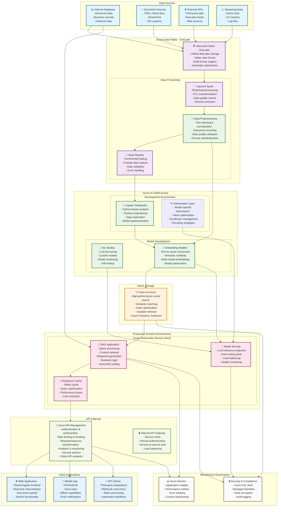

```mermaid
graph TB
    %% Data Sources
    subgraph "Data Sources"
        DS1[📊 Internal Database<br/>- Structured data<br/>- Business records<br/>- Historical data]
        DS2[📄 Document Sources<br/>- PDFs, Word docs<br/>- SharePoint<br/>- File systems]
        DS3[🌐 External APIs<br/>- Third-party data<br/>- Real-time feeds<br/>- Web services]
        DS4[📈 Streaming Data<br/>- Event hubs<br/>- IoT sensors<br/>- Log files]
    end

    %% Data Fabric Layer
    subgraph "Azure Data Fabric - OneLake"
        OL[🏗️ Microsoft Fabric OneLake<br/>- Unified data lake storage<br/>- Delta Lake format<br/>- Multi-format support<br/>- Automatic optimization]
        
        subgraph "Data Processing"
            SPARK[⚡ Apache Spark<br/>- Distributed processing<br/>- ETL transformations<br/>- Data quality checks<br/>- Schema evolution]
            
            PREP[🔧 Data Preprocessing<br/>- Text cleaning & normalization<br/>- Document chunking<br/>- Data quality validation<br/>- Format standardization]
            
            PIPELINE[🔄 Data Pipeline<br/>- Incremental loading<br/>- Change data capture<br/>- Data validation<br/>- Error handling]
        end
    end

    %% AI Development Environment
    subgraph "Azure AI Hub/Foundry"
        subgraph "Development Environment"
            NB[📓 Jupyter Notebooks<br/>- Python-based analysis<br/>- Feature engineering<br/>- Data exploration<br/>- Model experimentation]
            
            TOKENIZE[🔤 Tokenization Layer<br/>- Model-specific tokenization<br/>- Token optimization<br/>- Vocabulary management<br/>- Encoding strategies]
        end
        
        subgraph "Model Development"
            ML[🤖 ML Models<br/>- LLM fine-tuning<br/>- Custom models<br/>- Model versioning<br/>- A/B testing]
            
            EMB[🎯 Embedding Models<br/>- Text-to-vector conversion<br/>- Semantic similarity<br/>- Multi-modal embeddings<br/>- Model optimization]
        end
    end

    %% Vector Database
    subgraph "Vector Storage"
        FAISS[🔍 Faiss on Azure<br/>- High-performance vector search<br/>- Similarity matching<br/>- Index optimization<br/>- Scalable retrieval<br/>- Azure Container Instances]
    end

    %% Model Serving & Application Runtime
    subgraph "Production Runtime Environment"
        subgraph "Azure Kubernetes Service (AKS)"
            MODEL_SERVE[🚀 Model Serving<br/>- LLM inference endpoints<br/>- Auto-scaling pods<br/>- Load balancing<br/>- Health monitoring]
            
            RAG_APP[🧠 RAG Application<br/>- Query processing<br/>- Context retrieval<br/>- Response generation<br/>- Business logic<br/>- Horizontal scaling]
            
            CACHE[💾 Response Cache<br/>- Redis cache<br/>- Query optimization<br/>- Performance boost<br/>- Cost reduction]
        end
        
    end

    %% API Management
    subgraph "API Gateway"
        APIM[🚪 Azure API Management<br/>- Authentication & authorization<br/>- Rate limiting & throttling<br/>- Request/response transformation<br/>- Analytics & monitoring<br/>- Security policies<br/>- Public API endpoint]
        
        INTERNAL[🔒 Internal API Gateway<br/>- Service mesh <br/>- Internal authentication<br/>- Service-to-service auth<br/>- Load balancing]
    end

    %% Client Applications
    subgraph "Client Applications"
        WEB[🌐 Web Application<br/>- React/Angular frontend<br/>- Real-time chat interface<br/>- Document upload<br/>- Search functionality]
        
        MOBILE[📱 Mobile App<br/>- iOS/Android<br/>- Voice input<br/>- Offline capabilities<br/>- Push notifications]
        
        API_CLIENTS[🔌 API Clients<br/>- Third-party integrations<br/>- Webhook consumers<br/>- Batch processing<br/>- Automated workflows]
    end

    %% Monitoring & Management
    subgraph "Monitoring & Governance"
        MONITOR[📊 Azure Monitor<br/>- Application insights<br/>- Performance metrics<br/>- Error tracking<br/>- Custom dashboards]
        
        SECURITY[🔒 Security & Compliance<br/>- Azure Key Vault<br/>- Managed identities<br/>- Data encryption<br/>- Audit logging]
    end

    %% Data Flow Connections
    DS1 --> OL
    DS2 --> OL
    DS3 --> OL
    DS4 --> OL
    
    OL --> SPARK
    SPARK --> PREP
    PREP --> PIPELINE
    PIPELINE --> NB
    
    NB --> EMB
    PREP --> EMB
    EMB --> FAISS
    
    DS1 --> RAG_APP
    FAISS --> RAG_APP
    RAG_APP --> CACHE
    CACHE --> APIM
    
    TOKENIZE --> MODEL_SERVE
    EMB --> MODEL_SERVE
    ML --> MODEL_SERVE
    
    APIM --> WEB
    APIM --> MOBILE
    APIM --> API_CLIENTS
    
    RAG_APP --> MONITOR
    APIM --> MONITOR
    FAISS --> SECURITY
    RAG_APP --> SECURITY
    MODEL_SERVE --> SECURITY

    %% Styling
    classDef dataSource fill:#e1f5fe,stroke:#01579b,stroke-width:2px
    classDef processing fill:#f3e5f5,stroke:#4a148c,stroke-width:2px
    classDef aiHub fill:#e8f5e8,stroke:#1b5e20,stroke-width:2px
    classDef vector fill:#fff3e0,stroke:#e65100,stroke-width:2px
    classDef app fill:#fce4ec,stroke:#880e4f,stroke-width:2px
    classDef api fill:#f1f8e9,stroke:#33691e,stroke-width:2px
    classDef client fill:#e3f2fd,stroke:#0d47a1,stroke-width:2px
    classDef monitor fill:#fafafa,stroke:#424242,stroke-width:2px

    class DS1,DS2,DS3,DS4 dataSource
    class OL,SPARK,PIPELINE processing
    class NB,PREP,ML,EMB aiHub
    class FAISS vector
    class RAG_APP,CACHE,MODEL_SERVE,ACA app
    class APIM,INTERNAL api
    class WEB,MOBILE,API_CLIENTS client
    class MONITOR,SECURITY monitor
```