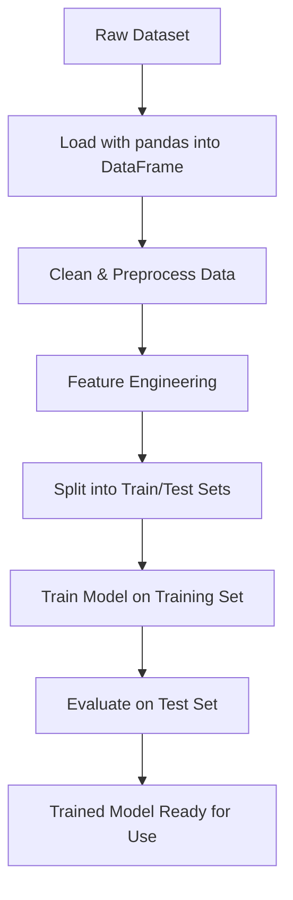

# Table of Contents
- [Machine Learning](#machine-learning)
- [Tools](#tools)
    - [Python and Libraries](#python-and-libraries)
    - [Anaconda](#anaconda)
    - [Jupyter Notebooks](#jupyter-notebooks)
    - [Data Version Control](#dvc)
    - [Weights and Biases](#weights--biases)
    - [MLflow](#mlflow)
    - [Cohere](#cohere)
    - [Pinecone](#pinecone)
    - [FAISS](#faiss)
    - [DagsHub](#dagshub)
    - [Kubeflow](#kubeflow)
    - [Langchain](#langchain)
- [MLOps](#mlops)

# Machine Learning

- **Machine Learning** is a subset of AI where you learn patters from data to make predictons or decisions without explicit programming. 
- You feed data to `algorithms` (linear regression, decision trees, neural networks) to produce a `model` - a serialized function that maps inputs to outputs.
- The models are trained on training data, but evaluated on `unseen` data.

- Train a model to predict engineer performance based on PRs, slack messages, incidents resolved:

```python
# Import pandas for data manipulation
import pandas as pd
# define a target label
performance = ["high", "average"]
# create a dictionary
# each developer has 5 features (pr_count, review_latency_hours, story_points, slack_messages_sent, incidents_resolved)
# each developer has 1 target label (performance)
data = {
    "pr_count": [12, 5, 18, 7, 3],
    "review_latency_hours": [4.2, 12.0, 3.5, 10.5, 16.0],
    "story_points": [35, 20, 40, 25, 15],
    "slack_messages_sent": [130, 80, 160, 90, 50],
    "incidents_resolved": [2, 0, 3, 1, 0],
    "performance": ["high", "average", "high", "average", "average"]
}
df = pd.DataFrame(data) # create a dataframe for manipulation

# train the model
from sklearn.model_selection import train_test_split
from sklearn.ensemble import RandomForestClassifier
from sklearn.metrics import classification_report

# Encode the target label
# Convert text labels to numbers
df["performance"] = df["performance"].map({"average": 0, "high": 1})

X = df.drop("performance", axis=1) # X: features (all columns except performance) - input data
y = df["performance"] # y: Target: performance column is what we want to predict

# Train/test split into 80% training, 20% testing
X_train, X_test, y_train, y_test = train_test_split(X, y, test_size=0.2, random_state=42)
# 4 rows for training, 1 for testing

# Train a simple classifier
model = RandomForestClassifier(random_state=42)
model.fit(X_train, y_train)

# Evaluate and print performance metrics
y_pred = model.predict(X_test)
print(classification_report(y_test, y_pred))

# Define new_data for prediction
new_data = [[10, 8.0, 30, 100, 1]]  # Same format as training features
# On any new data
prediction = model.predict(new_data)
```
- `X_train` - your training features (pandas dataframe or numpy array).
- `y_train` - your training labels/target values.
- `X_test` - your test features.
- `y_test` - your test labels.



## Tools

### Python and Libraries

- `Python` (core libraries and general-purpose libraries):
    - `Numpy`: Provides n-dimensional array objects and functions for linear algebra and random number capabilities.
    - `Pandas`: Provides structure like DataFrames (tabular data) and Series (1-dimensional labeled arrays) for cleaning, transforming, and visualizing data.
    - `Matplotlib`: Library for static/animated and interactive visualizations. Options for line plots, scatter plots, bar charts, histograms.
- `Scikit-learn`: Machine learning library for supervised and unsupervised learnings including classification, regression, clustering, dimensionality reduction, and model selection.
- `TensorFlow`: Developed by Google, Strong in deep learning and supports GPU and CPU.
- `PyTorch`: Developed by Facebook's AI Research Lab (FAIR). Used for rapid prototyping for computer vision or language processing.
- `Keras`: The official high-level neural networks API for Tensorflow (or CNTK or THeano).
- `XGBoost`: Optimized gradient boosting library, implements ML algorithms under the Gradient Boosting framework. Parallel tree boosting solves data science problems efficiently.

- **Sklearn** is a python library containing algorithms for:
    - **Classification**: Identifying which category an object belongs to.
        - Use cases: Spam detection, image recognition.
        - Algorithms: Gradient boosting, Nearest Neighbors, Random Forest, Logistic reg.
    - **Regression**: Predicting a continuous-valued attiribute.
        - Use cases: Drug respons, stock price tracking.
        - Algorithms: Gradient boosting, neirest neighhbors, random forest, ridge.
    - **Clustering**: Automatic grouping of similar objects into sets
        - Use cases: Customer segmentation, grouping outcomes.
        - Algorithms: K-means, HDBSCAN, hierarchical clustering.
    - **Dimensionality Reduction**: Reducing number of random variables to consider.
        - Use cases: Visualization, increase efficiency.
        - Algorithms: PCA, feature selection, non-negative matrix factorization.
    - **Model Selection**: Improved accuracy via parameter tuning.
        - Use cases: Improved accuracy via param tuning.
        - Algorithms: Grid search, cross validation, metrics.
    - **Preprocessing**: Feature extraction and normalization.
        - Use cases: Transforming input data
        - Algorithms: preprocessing, feature extraction.

### Anaconda

- **Anaconda** is an environment and package manager. `conda` is the command line tool.
    - With anaconda, you can create isolated environments with only the packages and versions you need, and export them to any platform.

```bash
# Create an anaconda environment
conda create --name env313 python=3.13

# Activate env and enter
conda activate env313

# Install pytorch
conda install -c pytorch pytorch

# List packages from inside the env
conda list

# Deactivate the environment/exit
conda deactivate

# List all envs and locations
conda info --envs

# Show channel urls
conda list --name env313 --show-channel-urls

# export an environment as yaml
conda env export -n env313 --from-history > env313.yml

# Create from yaml file
conda env create -f env313.yml
```

### Jupyter Notebooks

- **Notebooks** are interactive environments where you can explore data, build and test models, visualize results, document experiments.
    - Best used for experimentation and data science.

- Notebooks contain: `cells` (code + markdown), `metadata` (kernel info, tags), `outputs` (visualizations, errors), `execution_count` (order of cell runs)

- MLOps using Jupyter (notebooks)
1. Explore with `Notebook`.
1. Track Runs with `MLFlow/W&B` directly from the notebook.
1. Refactor to pipeline.
1. Automate in CICD.
1. Deploy model and monitor.

```bash
# Clean outputs before committing notebook
nbstripout your_notebook.ipynb

# automate notebooks with papermill
# papermill is a python tool that lets you automate
# and parameterize jupyter notebooks
papermill train.ipynb output.ipynb -p lr 0.01
# overwrite parameter lr with 0.01

# Convert your jupyter notebook to script
juptyer nbconvert --to script your_notebook.ipynb
```

- The `ipykernel` allows interactive computing in python, for example.

### DVC

- **Data version control (DVC)** is the concept of managing and versioning extremely large volumes of data (images, audio, video, text) for your ML modeling.
    - `.dvc` files contain metadata and checksums, not actual data.
    - Always run `dvc pull` after `git pull` when collaborating.
    - Actual data files are auto-created in the `data/.gitignore`

```bash
# Install DVC
pip install dvc
# intialize DVC in your project AKA a git repo
dvc init
# Initialize with remote storage
dvc init --subdir
# Data tracking, adding .dvc files
dvc add data/dataset.csv
dvc add models/
# Add remote storage (works with ssh, s3, remote)
dvc remote add -d myremote s3://mybucket/dvcstore
# Push and pull data
dvc push # push all tracked data
dvc push data/dataset.csv
dvc pull # pull all tracked data
dvc pull data/dataset.csv

# Create a pipeline stage
dvc stage add -n preprocess \
  -d data/raw.csv \
  -o data/processed.csv \
  python preprocess.py

# Create a training stage
dvc stage add -n train \
  -d data/processed.csv \
  -d src/train.py \
  -o models/model.pkl \
  -M metrics.json \
  python src/train.py

# Run the pipeline
dvc repro # run entire pipeline
dvc repro train # run specific stage

# Show pipeline as dag graph
dvc dag

# Data versioning and branches
# Create a new experiment branch
git checkout -b experiment-new-features
dvc checkout # switch DVC files to match git branch

# After making data changes
dvc add data/new_dataset.csv
git add data/new_dataset.csv.dvc

# Compare metrics between branches and commits
dvc metrics diff # compare with previous commit
dvc metrics diff HEAD~1 # Compare with specific commit
dvc metrics diff main experiment # compare between brances

# Status and Info
dvc status # local changes
dvc status --cloud # remote changes
dvc list . --dvc-only # list dvc-tracked files
dvc get-url data/model.pkl # get remote url for file

# Show cache directory location
dvc cache dir

dvc gc # remove unused cache files
dvc gc --workspace # remove files not in current workspace
```

### Weights & Biases

- **W&B Platform** is the platform that helps track and visualize machine learning models, experiments and more.
    - Experiment tracking: Logs model run metrics, hyperparams, versions, configs, etc.
    - Model versioning: Use the model registry.
    - Dataset versioning: `wandb artifacts` to track changes to datasets
    - Collaborative reporting: Teams can see and comment on runs.
    - Hyperparameter tuning:
    - Training visualizations
    - Monitoring:

- W&B *integrates* with: Python SDK, PyTorch, TensorFlow, Hugging Face, sklearn, and notebooks.

```python
import wandb

wandb.init(project="my-ml-project", config={
    "epochs": 10,
    "batch_size": 32,
    "learning_rate": 0.001
})

for epoch in range(10):
    train_loss = 0.01 * epoch
    val_accuracy = 0.8 + 0.01 * epoch
    wandb.log({"train_loss": train_loss, "val_accuracy": val_accuracy})
```

- **W&B Weave** - lets you use AI models in your application with features like tracing, output evalutation, cost estimates, and inference service with playground for comparing LLMs.

- **W&B Models** - Mangage AI model development with training, fine-tuning, reporting, hyperparameter sweeps, model registry.

- **Core components of W&B Models/Weave**: Registry, Artifacts, Reports, Automations, Secrets.


### MLFlow

- **MLflow** is an open-source platform from Databricks, for managing the machine learning lifecycle.
    - Provides tools for experiment tracking, model packaging, versionining, and deployment.
    - Find out your best model and how to deploy it, and compare models.
    - MLflow has a UI where you can view your experiments, paramters, metrics, tags, etc.

- Tip: Install conda forge for MLflow fof enhanced capabilities: `conda install -c conda-forge mlflow`

#### MLFlow for ML

```python
pip install mlflow
# Or with extras like sklearn, tensorflow
pip install mlflow[extras]

# Run a local version of MLflow
mlflow ui
# Or
# Create a managed MLFlow tracking server
mlflow server --host 127.0.0.1 --port 8080

# Set tracking server URI if not Databricks managed
# We are using the localhost it created
import mlfow
mlflow.set_experiment("First Experiment")
mlfow.set_tracking_uri(uri="http://<host>:<port>")

# Start an mlflow run after you train your model
with mlfow.start_run(my_run_name):
    mlflow.log_params(params)
    mlflow.log_metrics({ # Taken from python report dict
        'accuracy': report_dict['accuracy'],
        'recall_class_0': report_dict['0']['recall'],
        'recall_class_1': report_dict['1']['recall'],
        'f1_score_macro': report_dict['macro avg']['f1-score'],
    }) # Output of model training
    mlflow.sklearn.log_model(lr, "Logistic Regression") # Model name, artifact path
```

- You can then view your Model metrics, system metrics, artifacts in the UI.
    - Exports the model as `pkl` file.
    - Contains python and conda environment yamls.

- Each run in MLFlow has a `Run ID` that uniquely identifies that run, and can be registered in the **model registry**.

```python
model_name = "XGB-Smote"
run_id = input("Enter runID: ")
model_uri = f"runs:/{run_id}/{model_name}
result = mlflow.register_model(
    model_uri, model_name
)
```

- When you are testing new models, you call new ones `challenger`, since the one in production is `champion`.

- Load a model once its registered:

```python
model_version = 1
model_uri = f"models:{model_name}/{model_version}"
loaded_model = mlflow.xgboost.load_model(model_url) # Specifically the XGBoost flavor
# Go to the model registry, download it, and perform operations
y_pred = loaded_model.predict(X_test)
y_pred[:4]
```

- **MLFlow pipelines** are `yaml` defined pipelines that define your data, sql, data splits, data training, evaluation, metrics etc from **Databricks**.

- Pipeline command syntax (used in a notebook), referenced from `pipeline.yaml`:

```python
from mlflow.pipelines import Pipeline
p = Pipeline(profile="databricks")
p.clean()
p.inspect()
p.run("ingest") # pull data into local folder
p.run("split")  # split into foundation, test
p.run("transform") # add a column for example
p.run("train")
p.run("evaluate")
```

#### MLFlow for GenAI

### Cohere

- **Cohere** is an `embedding model`, it ransforms text into numerical vectors that can then be uploaded into a vector store.

- Cohere is paid, but open source `sentence-transformers` exist, which are completely free.

```python
# This creates an embedding (a list of numbers)
text = "The cat sat on the mat"
embedding = cohere.embed(text)
# Result: [0.2, -0.8, 0.1, 0.4, ...]  (1536 dimensions)
```

### Pinecone

- **Pinecone** is a vector store, a managed database for storing and searching embeddings to work alongside your LLM applications like RAG. Pinecone handles infrastructure and scaling, as well as real-time updates.
  - **Use Cases**:
    - Retreival-Augmented Generation (RAG):
    - Semantic Search: Enables search systems to understand the "meaning" behind a query rather than just matching keywords.
    - Recommendation Systems: Embedding user preferences, past interactions, item features.
    - Anomaly Detection: Finding outliers in data based on "normal" clustering of vectors.
    - DeDuplication:
    - Image/Audio Search: Based on visual or auditory similarity vs. metadata or tags.

- Open source vector databases: 
  - `chromadb`: Developer friendly, especially made for RAG applications. Good for prototyping or smaller scale apps.
  - `qdrant`: More user friendly
  - `faiss`: Facebook AI Similarity Search. Open-source library for similarity serach and clustering of dense vectors. More complicated, custom ML Pipelines. 

- Example Flow:
1. Store documents -> Pinecone (as embeddings)
1. User asks question -> Search Pinecone for relevant docs
1. Retrieved docs -> question -> Send to LLM
1. LLM generates answer using context

#### Pinecone Strategies

- Your index determines how vectors are stored and searched. You choose the metric, pod type, and index type based on the use case.

- **Metrics**:
  - `Cosine`: Best for text embeddings, measures angle between vectors (semantic similarity)
  - `Dot Product`: Unnormalized, similar to cosine. Recommendation engine friendly.
  - `Euclidean (L2)`: Straight line distence, numerical feature vectors or image embeddings.

- **Index Types**:
  - `Pod-Based (exact search)`: Stores vectors in memory, provides **exact nearest neighbor search**.
    - `Pod Types`: S1 (Standard), P1 (Performance - mid), P2 (Performance - high).
  - `Serverless (approx. search)`: Approximate nearest neighbors (ANN) under the hood for faster, cheaper queries at scale. Slight accuracy tradeoff


### FAISS

FAISS supports **Exact Search** and **Approximate Nearest Neighbor (ANN)** methods to balance speed, recall, and memory usage.

#### Exact Search (Brute Force)
- **IndexFlatL2 / IndexFlatIP**  
  - Compares the query vector to all vectors (L2 = Euclidean, IP = inner product).  
  - **Best for:** Small/medium datasets, 100% recall, benchmarking, no memory concerns.  
  - **Trade-off:** Slow and memory-heavy for large datasets.

#### Approximate Nearest Neighbor (ANN)

- **IVF (IndexIVFFlat)**
  - Partitions vectors into clusters (nlist), searches within nearest clusters (nprobe).  
  - **Best for:** Large datasets, faster search with acceptable recall trade-off.  
  - **Trade-off:** Recall depends on nprobe; requires training on sample data.

- **PQ (IndexPQ)** 
  - Compresses vectors into sub-vectors, quantized independently.  
  - **Best for:** Very large datasets where memory efficiency is critical.  
  - **Trade-off:** Lossy compression reduces recall.

- **IVFPQ (IndexIVFPQ)**  
  - Combines IVF clustering with PQ compression of residuals.  
  - **Best for:** Massive datasets where speed and memory efficiency are both needed.  
  - **Trade-off:** More complex to train/configure, but offers strong performance.

- **HNSW (IndexHNSWFlat / IndexHNSWPQ)**  
- Builds a **hierarchical** graph for fast nearest neighbor search.  
- **Best for:** High recall, low latency, datasets from millions to hundreds of millions.  
- **Trade-off:** Higher memory use than IVF; slower index build time but faster queries.


### Dagshub

- **DagsHub** is the Github for ML, it provides a central hub for ML engineers to collaborate on ML projects.
    - Version control for Code, Data, Models, and Experiments.
    - Integrates with MLflow for experiment tracking.
    - Visualize ML pipelines flow. (Ingest -> Split -> Transform -> Train -> Evaluate -> Register -> Predict)
    - Supports integrating with annotation tools, to collaborate on labeling data directly.
    - Use `.dvc` files that point to your data stored on Dagshub or another data storage.

### Kubeflow

- **Kubeflow** is an ecosystem of open-source projects to address each stage of the ML SDLC. Kubeflow makes AI/ML on Kubernetes portable and scalable.
    - Standalone Kubeflow components are meant to be installed individually, as opposed to the bundle called **Kubeflow Platform**.
        - Kubeflow Platform includes Kubeflow Noteooks, and Central Dashboard, as well as data management viewer and TensorBoards for visualizations.

- *Kubeflow Components*: KServe (online and batch inference in model serving), Trainer (large scale distributed training/tuning), Pipelines, Notebooks, Katlib (model optimization.hyperparam tuning), Model Registry, Dashboard, MPI operator, Spark Operator (data prep and feature engineering), Feast (feature store for online/offline features)

- *AI Ecosystem components*: Pytorch, XGBoost, MPI, Optuna, HuggingFace, Megatron-LM, TensorFlow, Sklearn, DeepSpeed, Hyperopt, Horovod.

- Using the Python SDK (basics):

```python
pip install kfp #kubeflow pipelines
#Components, python function wrapped with decorator
from kfp import dsl
@dsl.component
def add(a: int, b: int) -> int:
    return a + b

@dsl.pipeline(name="my-example-pipeline")
def my_pipeline():
    # pass outputs to other components here

# Turn pipeline into yaml
from kfp import compiler
compiler.compiler().compile(my_pipeline, 'pipeline.yaml')
```

- Example workflow:

```python
@dsl.component
def preprocess(data_path: str) -> str:
    ...

@dsl.component
def train(cleaned_data: str):
    ...

@dsl.pipeline
def my_pipeline():
    step1 = preprocess('gs://bucket/data.csv')
    train(step1.output)

```

- Note: Use `kfp.Client(host='...')` and pass credentials or tokens especially if hosted on GCP/AWS.

### LangChain

- **LangChain** is a framework that uses existing LLMs (chatGPT, Gemini, Claude, etc), to build applications using the pretrained models and chain sequences of operations together to create complex workflows. 
- Prompt templates, parsers, or functions are known as **Runnables**. WHen you chain Runnables together using `|` you create a **RunnableSequence**.
    - `Chains`: sequences of operations.
    - `Prompts`: templates for structuring input into language models.
    - `Memory`: components that let your app remember previous conversations. Crucial for **multi-turn chatbots**.
    - `Agents`: can use tools and make decisions about actions to take based on input. Call APIs, search DBs, perform functions.
    - `Retrievers`: help implement RAG, pulling relevant info into the LLM's knowledge.

- Example chain: 
1. Take user question -> 
1. search company docs ->
1. format the retrieved info into a prompt -> 
1. Sends it to LLM -> 
1. Parses/validates response

- [Tutorial](https://python.langchain.com/docs/tutorials/llm_chain/)

```python
from langchain_core.prompts import ChatPromptTemplate
from langchain_openai import ChatOpenAI
from langchain_core.output_parsers import StrOutputParser

# Define your components
prompt = ChatPromptTemplate.from_template("Tell me a short story about {topic}.")
llm = ChatOpenAI(model="gpt-4o-mini")
output_parser = StrOutputParser()

# Chain them using the pipe operator
chain = prompt | llm | output_parser

# Invoke the chain
result = chain.invoke({"topic": "a brave knight"})
print(result)
```

- Example with multiple PromptTemplates to create a **RunnableParallel**, modifying initial prompts.

```python
from langchain_core.runnables import RunnableParallel, RunnablePassthrough
from langchain_openai import ChatOpenAI
from langchain_core.prompts import ChatPromptTemplate
from langchain_core.output_parsers import StrOutputParser

# Define some components
question_gen_prompt = ChatPromptTemplate.from_template("Generate a rephrased question for: {question}")
answer_gen_prompt = ChatPromptTemplate.from_template("Answer the question: {question}")
llm = ChatOpenAI(model="gpt-4o-mini")
output_parser = StrOutputParser()

# Run two branches in parallel
chain = RunnableParallel(
    rephrased_question=question_gen_prompt | llm | output_parser,
    original_question=RunnablePassthrough() # Pass the original input through
)

result = chain.invoke({"question": "What is the capital of France?"})
print(result)
# Example output: {'rephrased_question': 'Could you tell me the capital city of France?', 'original_question': 'What is the capital of France?'}
```

- **RunnableLambda** is any Python function wrapped into a Runnable.

```python
from langchain_core.runnables import RunnableLambda

def capitalize_string(text: str) -> str:
    return text.upper()

capitalize_runnable = RunnableLambda(capitalize_string)

chain = RunnablePassthrough() | capitalize_runnable

result = chain.invoke("hello world")
print(result) # Output: HELLO WORLD
```

#### Embeddings in RAG workflow

- **Embeddings** are numerical representations of text that capture semantic meaning. Questions to the LLM get embedded into a vector, and then you perform a similarity search on the vector database. You then retreive the most similar documents and pass them to the LLM as context.

- Documents are *split* up since the context window of a a LLM is lmited. Splitting a document allows for the chunks to fit in the LLM context. You can use a package like `tiktoken` to see how large docs are. Would use `langchain.text_splitter` to help with recursive character splitting over large docs. These chunks are turned to vectors by an embedding model, and then these vectors are stored in a database to enable fast similarity searches.

- An embedding model, like `text-embedding-3-small` is what converts the text into a vector.

```python
from langchain_core.prompts import ChatPromptTemplate
from langchain_openai import ChatOpenAI, OpenAIEmbeddings
from langchain_core.output_parsers import StrOutputParser
from langchain_core.runnables import RunnablePassthrough
from langchain_community.vectorstores import FAISS
from langchain_core.documents import Document

# 1. Define your components (including a retriever)
prompt = ChatPromptTemplate.from_template(
    "Answer the question based only on the following context:\n{context}\n\nQuestion: {question}"
)
llm = ChatOpenAI(model="gpt-4o-mini")
output_parser = StrOutputParser()

# Create a simple vector store and a retriever
documents = [
    Document(page_content="The brave knight Sir Reginald defeated a dragon."),
    Document(page_content="Dragons are legendary serpentine creatures of immense power."),
    Document(page_content="Sir Reginald was known for his shiny armor.")
]
vector_store = FAISS.from_documents(documents, OpenAIEmbeddings())
retriever = vector_store.as_retriever()

# 2. Chain them using RunnablePassthrough to pass both the context and question to the prompt
rag_chain = (
    {
        "context": retriever,  # This retrieves relevant documents based on the input
        "question": RunnablePassthrough(),  # This passes the original input ("brave knight") to the next step
    }
    | prompt
    | llm
    | output_parser
)

# 3. Invoke the new RAG chain
result = rag_chain.invoke("Tell me about the brave knight.")
print(result)
```
- Documents with similar vectors have similar semantic meaning. When you search, you measure the distance between questions vector <-> documents vector. Smaller distance means higher degree of similarity. This is a **similarity seach**.
- A **prompt** is the template that contains the placeholders for context, and question. When you invoke the chain, context/question are inserted which creates a complete prompt. THIS is passed to the LLM and used to generate the response. 
  - Invoke a chain: `chain.invoke({"context": $context, "question": $question})`
  - Pull a RAG template: `hub.pull("rlm/rag-prompt")`

- Pass **Structured Output** to the LLM to get desired output using pydantic and `llm.with_structured_output(PydanticClass)`
  - Pass PydanticClass DATA_SOURCES dictionary so the llm can fill in the information.

- Two examples:

```python
from langchain_core.pydantic_v1 import BaseModel, Field
from langchain_core.output_parsers import JsonOutputParser

# 1. Define the desired output schema using Pydantic BaseModel
# This schema dictates the structure, field names, and data types
class Book(BaseModel):
    """Information about a book."""
    title: str = Field(description="The title of the book")
    author: str = Field(description="The author of the book")
    publication_year: int = Field(description="The year the book was published")
    genre: str = Field(description="The primary genre of the book")
    is_fiction: bool = Field(description="True if the book is fiction, False otherwise")

# 2. Initialize the ChatOpenAI model
# We use .with_structured_output() to tell the model to generate output
# conforming to our Pydantic schema. This implicitly handles tool calling
# and response parsing for OpenAI's function calling capabilities.
llm = ChatOpenAI(model="gpt-4o-mini", temperature=0).with_structured_output(Book)

```


```python
# 1. Define your data sources
# In a real application, these might be databases, APIs, specific documents, etc.
# Here, we'll use a simple dictionary mapping IDs to content.
DATA_SOURCES = {
    "1": {"name": "Product Catalog", "content": "This source contains information about electronic gadgets, clothing, and home appliances."},
    "2": {"name": "Customer Support FAQs", "content": "This source has answers to frequently asked questions regarding order status, returns, and technical issues."},
    "3": {"name": "Company News & Events", "content": "This source provides details about recent company announcements, upcoming events, and press releases."},
    "4": {"name": "Employee Directory", "content": "This source lists employee contact information, departments, and roles."}
}

# Extract available data source IDs for the LLM prompt
available_data_source_ids = list(DATA_SOURCES.keys())

# 2. Define the desired structured output for the LLM
# This Pydantic model tells the LLM exactly what information to extract:
# which data source ID to choose and why.
class DataSourceChoice(BaseModel):
    """Represents the chosen data source based on a user's question."""
    # Using Literal ensures the LLM can only pick from the predefined IDs
    chosen_id: Literal[tuple(available_data_source_ids)] = Field(
        description=f"The ID of the most relevant data source for the user's question. Choose from: {', '.join(available_data_source_ids)}"
    )
    reasoning: str = Field(
        description="Brief explanation of why this data source was chosen."
    )

# 3. Set up the LLM with structured output
# We bind the DataSourceChoice schema to the LLM using .with_structured_output().
# This makes the LLM try to "fill in" an instance of DataSourceChoice.
llm = ChatOpenAI(model="gpt-4o-mini", temperature=0).with_structured_output(DataSourceChoice)

# 4. Create a prompt template for the LLM
# The prompt clearly instructs the LLM on its task: to select a data source.
# It also provides the list of available data sources.
prompt_template = ChatPromptTemplate.from_messages(
    [
        ("system", (
            "You are a helpful assistant whose sole purpose is to identify the most relevant data source "
            "for a given user question from a predefined list. "
            "You must select one of the following data source IDs: {data_source_ids}. "
            "Think step-by-step before making your final selection."
        )),
        ("human", "User question: {question}"),
        ("human", "Based on the user's question, which data source should I use? Provide the ID and your reasoning.")
    ]
)

# 5. Build the data source selection chain
# The chain takes the user's question, formats it into the prompt, and sends it to the LLM.
# The LLM's output will be a DataSourceChoice object.
data_source_selection_chain = prompt_template | llm

# 6. Function to retrieve content based on LLM's choice
def get_selected_data_content(selection_output: DataSourceChoice, all_data_sources: Dict[str, Any]) -> Dict[str, Any]:
    """Retrieves the content of the chosen data source."""
    chosen_id = selection_output.chosen_id
    if chosen_id in all_data_sources:
        print(f"\nLLM chose data source ID: {chosen_id}")
        print(f"LLM Reasoning: {selection_output.reasoning}")
        return all_data_sources[chosen_id]
    else:
        print(f"\nError: LLM chose an invalid data source ID: {chosen_id}")
        return {"name": "Invalid Source", "content": "No content found for this ID."}
```

## Cloud Services

### Azure

#### Azure AI Foundry

**Azure AI Foundry** is Microsoft's enterprise-grade platform for building, managing, and operationalizing AI solutions, particularly focused on the development and deployment of **large language models (LLMs)** and **foundation models**. It combines data preparation, experimentation, prompt engineering, fine-tuning, and secure deployment in a unified environment designed for MLOps and LLMOps workflows.

- **Core Capabilities**

- **Multimodal Model Support**
  - Text, image, and code generation models (e.g., OpenAI, Phi-3, Florence, GPT, DALL·E)
  - Foundation model catalog with evaluation metrics and sandboxed exploration

- **Model Customization & Prompt Engineering**
  - Prompt flow design with chaining logic
  - Zero-shot, few-shot, or fine-tuned modes
  - Evaluate prompts using human feedback or metrics

- **AI Studio & Foundry Notebooks**
  - Integrated with VS Code and Jupyter
  - Secure workspace for Python-based data prep and model iteration
  - Git integration and CI/CD-friendly

- **Data-Centric Engineering**
  - Integrates directly with **Microsoft Fabric** (e.g., OneLake, Delta tables)
  - Data lineage tracking and labeling tools
  - Grounded in **Responsible AI** practices (transparency, fairness, auditability)

- **Model Evaluation & Deployment**
  - Human-in-the-loop testing and blind review
  - Evaluate across accuracy, latency, cost, safety
  - Managed endpoints via **Azure Kubernetes Service (AKS)** or **Container Apps**

## MLOps & LLMOps Integration

- **Model Registry**
  - Track, version, and compare foundation models
  - Store evaluation metrics, prompt flows, and fine-tuned artifacts

- **Pipeline Orchestration**
  - Connect to **Azure ML Pipelines**, **Azure Data Factory**, and **GitHub Actions**
  - Trigger workflows based on new data, model drift, or events

- **Responsible AI Integration**
  - Interpretability dashboards
  - Built-in content moderation and safety filters

- **Enterprise Security**

- **Azure Key Vault** for managing secrets, tokens, and credentials
- **Managed Identities** for workload identity isolation
- **VNet Integration**, **Private Endpoints**, and **RBAC**

##### Integration with Azure API Management (APIM)

Azure AI Foundry supports **API-level abstraction and management** for serving your LLMs or RAG applications using APIM. Key benefits:

- **Secure Access** to AI endpoints using OAuth2, keys, or Azure AD
- **Rate Limiting / Throttling** for fair usage and DDoS protection
- **Request/Response Logging** for audit and debugging
- **Versioned Model APIs** for gradual rollout and rollback
- **Centralized Gateway** for frontend apps, partner orgs, and internal teams

### Example Integration Flow

```text
Client App (Web / Mobile / CLI)
        │
        ▼
Azure API Management
        │
        ▼
RAG App / LLM Inference Endpoint (AKS or Azure ML Managed Endpoint)
        │
        ▼
Vector Store (e.g., Faiss) + Data Sources
```

### Google

#### Vertex AI

**Vertex AI** is Google Cloud's fully managed, end-to-end machine learning (ML) platform that unifies the development and deployment of ML models. It abstracts infrastructure while offering flexibility and modularity for advanced ML practitioners.

- **Model Training**
  - Custom training using containers or prebuilt frameworks (TensorFlow, PyTorch, Scikit-Learn)
  - Distributed training, hyperparameter tuning, and automatic resource scaling
  - Managed pipelines using **Vertex AI Pipelines** (based on KFP v2)

- **Model Deployment**
  - Fully managed, autoscaled prediction endpoints
  - Supports real-time (online) and batch (offline) predictions
  - A/B testing and model monitoring built-in

- **Feature Store**
  - Centralized repository for storing, sharing, and reusing ML features
  - Online (low-latency) and offline (batch) serving capabilities
  - Feature consistency between training and serving

- **Vertex AI Workbench**
  - Managed Jupyter notebooks with full GCP integration
  - Supports Git sync, scheduling, BigQuery, and auto-shutdown

- **Vertex AI Matching Engine**
  - Approximate nearest neighbor (ANN) vector similarity search
  - Built for large-scale embedding search (e.g., for RAG, recommender systems)
  - Uses tree-AH and brute force options with optimized latency

- **Vertex AI Model Registry**
  - Central registry to manage model versions, metadata, and lineage
  - Integrates with CI/CD workflows and governance policies

- **LLM + GenAI Integration**

- **PaLM 2 / Gemini APIs** via **Vertex AI Studio**
- **Text Embedding APIs**, **Codey**, and **Imagen** models
- Supports **prompt tuning**, **adapter-based fine-tuning**, and **RLHF-like flows**

- **Ecosystem Integration**

- **BigQuery ML** for SQL-based ML workflows
- **TensorBoard**, **Weights & Biases**, and **MLflow** integration
- CI/CD with **Cloud Build**, **Cloud Functions**, **Artifact Registry**

## MLOps

- **MLOps** bridges the gap between the experimental, development phase of machine learning and the CI/CD practices of software engineering. The goal is to standardize and streamline the entire ML lifecycle, from **data collection** and **model development** to **deployment**, **monitoring**, and **retraining**.

- **Examples of MLOps in Action**:
  - Fraud Detection System: Real-time monitoring of transaction patterns, auto-retraining when drift is detected.
  - Recommendation Engine for E-Commerce: Daily batch updates for product recommendations.
  - Predictive Maintencance in Manufacturing: Streaming IoT data in ML Pipelines.

- **MLOps Principles**:
  - Automation: data ingestion, preprocessing, model training, validation, deployment.
  - Versioning and Reproducability: tracking changes in data (Using DVC) code, models, and infrastructure (git). Ensure the same results can be repeated under the same conditions.
  - CI/CD:
  - CT (Continuous Training): Automatic retraining of ML models in prod when new data becomes available or model performance degrades.
  - Continuous Monitoring: Real-time monitoring of model performance, data quality and system health. Monitor metrics, API calls, etc.
  - Model Governance: AI Ethics, Efficiency, Security, Compliance.
  - Collaboration: Integrate Data Scientists, ML Engineers, Operations teams

- **Trending MLOps Technologies**:

| Category | Tools & Platforms | Details | Open-Source Alternatives |
|----------|-----------------|---------|-----------------------|
| **Experiment Tracking** | MLflow, W&B, Neptune.ai | Track experiments, hyperparameters, and results. Enable reproducibility, collaboration, and comparison of ML runs. | Sacred, Guild AI, Polyaxon |
| **Data Versioning** | DVC, Pachyderm, LakeFS | Manage datasets like code, version large files, ensure reproducibility of ML pipelines, and enable data lineage tracking. | Git LFS, Quilt, Delta Lake |
| **Model Serving** | Seldon Core, KFServing, BentoML, TorchServe | Deploy trained models to production with *REST/gRPC endpoints*, enable scaling **on top of Kubernetes**, and manage A/B testing or canary releases. | MLServer, Ray Serve, Triton Inference Server |
| **Pipelines** | Kubeflow Pipelines, Apache Airflow, ZenML | Orchestrate and automate ML workflows, from data ingestion to model deployment, with reproducibility and scheduling. | Metaflow, Prefect, Flyte |
| **Monitoring** | Evidently AI, Arize AI, WhyLabs | Monitor model performance, detect data drift, identify anomalies, and alert when retraining is needed. | Prometheus + Grafana, OpenInference, Superwise community edition |
| **Cloud Platforms** | AWS SageMaker, Azure ML, GCP Vertex AI, Databricks | Fully managed ML platforms offering training, deployment, data labeling, and integrated MLOps capabilities. | OpenMLOps, OpenShift AI, MLRun |
| **Containers & Orchestration** | Docker,K8s, Helm | Package models/applications as containers, orchestrate workloads, and manage deployments with repeatable Helm charts. | Podman, OpenKruise, Kustomize |


